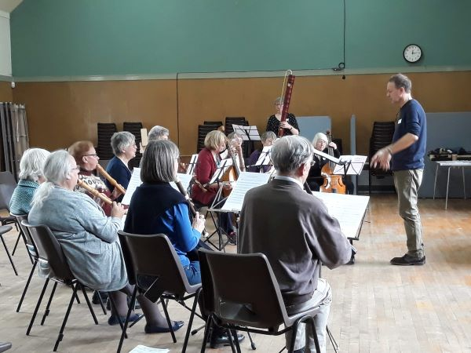

# About EMFS

The Early Music Forum of Scotland (EMFS) brings together singers, players, listeners and instrument makers from around Scotland with an interest in the medieval, renaissance and baroque periods. Our members range from professional to amateur, from singers to players of viols, recorders, sackbutt, cornett and more!

We organise an early music choir, occasional choral and instrumental workshops and coaching weekends, and early music performances in public spaces. Most of our events currently take place in Edinburgh (but we’d love to find people willing to organise events elsewhere in Scotland).

We are a member-run and self-funded voluntary organisation.

## Join us
Help us to support early music events in Scotland by becoming a member of EMFS. Go to our Membership page to find out about membership benefits and how to join. EMFS members are automatically enrolled in our Events Mailing List.

## Events Mailing List
Our free events e-mailing list will help to keep you informed about early music events, workshops and courses. To add your name, email chairperson@emfscotland.org.uk

## Take part
View our Diary for details of forthcoming participatory activities run by EMFS for singers and players.

Do you have an idea for an early music event, and the time and energy to help to make it happen? Contact the Chair of EMFS on chairperson@emfscotland.org.uk

## Share
Are you a member of a choir or instrumental group (amateur or professional)? We can publicise your concert or event to our e-mailing list, if it includes early music. Email the details to chairperson@emfscotland.org.uk . Please give at least 2 weeks’ advance notice.

Early music performance groups and other relevant organisations can send us a link to your website to add to our Links page.

Follow us on Facebook to share news and information about early music matters.
